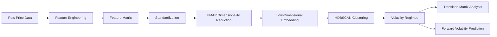
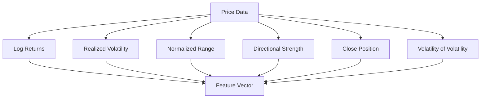
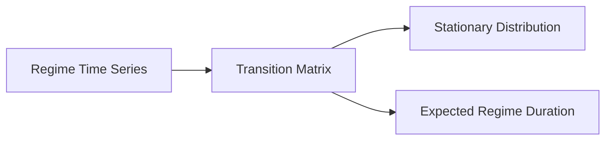

### Intraday Volatility Regime Detection using Unsupervised Machine Learning : Evidence from the NIFTY Index
[](https://doi.org/10.5281/zenodo.18894223)

## Project Overview

Financial markets exhibit dynamic volatility states that change over time. This project uses unsupervised machine learning techniques to detect latent volatility regimes in high-frequency financial time-series data.

Using 5-minute NIFTY index data, the framework applies:

  - Feature engineering from price data

  - Nonlinear dimensionality reduction (UMAP)

  - Density-based clustering (HDBSCAN)

  - Regime transition analysis

  - Volatility forecasting validation

## Workflow



## Feature Engineering Pipeline

Each 5-minute observation is converted into a feature vector representing market state.



Feature vector example:

X_t = [
log_return,
realized_vol,
vol_change,
normalized_range,
directional_strength,
close_position,
vol_of_vol
]

## Machine Learning Pipeline

The core ML workflow uses UMAP + HDBSCAN.


## Regime Transition Modeling

Detected regimes are analyzed using a Markov transition framework.


## Repository Structure
```
intraday-volatility-regime-detection
│
├── notebooks
│ ├── 01_data_collection.ipynb
│ ├── 02_feature_engineering.ipynb
│ ├── 03_regime_clustering.ipynb
│ └── 04_analysis.ipynb
│
├── figures
│ ├── umap_regimes.png
│ ├── transition_matrix.png
│ └── forward_volatility.png
│
├── paper
│ └── paper.pdf
│
├── requirements.txt
└── README.md
```
## Requirements

```
pandas
numpy
scikit-learn
umap-learn
hdbscan
matplotlib
seaborn
scipy
yfinance
```
Install dependencies:

```
pip install -r requirements.txt
```
## Dataset

The analysis uses **5-minute observations of the NIFTY index**.

Data fields include:

- Open
- High
- Low
- Close
- Timestamp

From these observations, a set of price-derived features are constructed to represent local market dynamics.

Due to licensing restrictions, raw data is not distributed with this repository.  
However, the notebooks demonstrate how to retrieve and preprocess the data.

## Results

### UMAP Embedding of Market States


The UMAP embedding reveals clusters corresponding to distinct volatility regimes in the NIFTY index.

### Regime Transition Matrix


The transition matrix highlights persistence in volatility regimes and the probability of switching between states.

### Forward Volatility by Regime


Detected regimes exhibit strong predictive relationships with forward realized volatility.

The analysis reveals:

  - A dominant low-volatility baseline regime

  - Short-lived high-volatility regimes

  - Strong regime persistence

  - Significant relationship between regimes and future realized volatility


## Reproducibility

To reproduce the analysis:

1. Clone the repository
 ```
git clone https://github.com/YOUR_USERNAME/intraday-volatility-regime-detection.git
```

2. Install dependencies

```
pip install -r requirements.txt

```

3. Run notebooks in order
```
01_data_collection.ipynb
02_feature_engineering.ipynb
03_regime_clustering.ipynb
04_analysis.ipynb
```

Each notebook corresponds to a stage of the research pipeline.

## Future Work

Potential research directions include:

  - Multi-year regime analysis

  - Incorporating volume and order-flow features

  - Self-supervised representation learning for time-series

  - Regime-aware neural forecasting models

### Author
Preethi S R

M.Tech – Artificial Intelligence & Data Science

Indian Institute of Technology Patna

## Citation

If you use this work, please cite

```bibtex

 @article{preethi2026volatility,
title={Intraday Volatility Regimes via Unsupervised Machine Learning: Evidence from the NIFTY Index},
author={Preethi S R},
year={2026},
doi={10.5281/zenodo.18894223}
}
```
